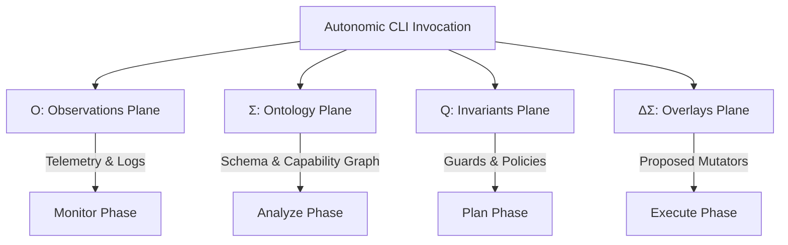

# Autonomic CLI Layer: Self-Healing, Diagnostics, and MAPE-K Loop Closure Specification

**Status:** Proposed for v6.0 (Phase 3)  
**Timeline:** 2026-06-30 – 2026-07-11

This document details the architecture, schemas, and integration patterns for the **Autonomic CLI Layer** in `clap-noun-verb`. It specifies how machine-grade interfaces enable autonomous agents and orchestrators to achieve self-healing, run diagnostic reporting, and establish closed-loop MAPE-K (Monitor-Analyze-Plan-Execute-Knowledge) control loops.

---

## 1. Architectural Foundation & Conceptual Planes

Traditional command-line interfaces are designed for human operators, assuming interactive decision-making and error recovery. In contrast, the Autonomic CLI Layer treats the terminal as a **machine-grade contract** designed for software agents, automated control loops, and distributed orchestrators.

The architecture is organized around four conceptual planes (referred to as the **O-Σ-Q-ΔΣ framework**), separating telemetry, topology, policy, and state transitions.



### The O-Σ-Q-ΔΣ Framework

1. **O (Observations Plane)**: Focuses on telemetry, tracing, logs, and output receipts. It answers: *What is the current health, latency, and performance of command execution?*
2. **Σ (Ontology Plane)**: Focuses on capability discovery, command dependency graphs, and structural schemas. It answers: *What commands are available, what inputs do they require, and how are they structurally related?*
3. **Q (Invariants / Guards Plane)**: Enforces hard resource budgets, safety policies, and pre-execution constraints. It answers: *Is it safe to execute this command under current latency, memory, and security bounds?*
4. **ΔΣ (Overlays Plane)**: Manages proposed modifications, runtime configuration overrides, and transition schema updates. It answers: *What mutations will occur, and how should configuration be hot-swapped during execution?*

---

## 2. Self-Healing Command Mechanics

Self-healing commands enable the CLI environment to automatically adapt to execution anomalies, bad configurations, or invalid command strings without human intervention. The autonomic interface implements three global recovery flags and three automated remediation actions.

### 2.1 Execution Flags

*   `--autonomic`: Evaluates the execution environment, enables runtime recovery actions, and formats all outputs (including errors) as structured JSON envelopes.
*   `--enforce-guards`: Actively intercepts command execution if resource budgets (e.g., max CPU time, max memory usage, or max latency) are breached, yielding a structured error rather than an uncontrolled crash.
*   `--receipt-only`: Disables standard stdout output and returns only a machine-readable execution receipt summarizing duration, status, and state transitions.

### 2.2 Automated Recovery Actions

When an invocation fails under `--autonomic` mode, the CLI evaluates the failure against registered **Action Templates** to return executable self-healing instructions:

#### A. Command Spellcheck and Alignment (Levenshtein Distance)
If a command or verb is misspelled, the CLI calculates the Levenshtein distance against registered nouns and verbs, automatically formulating a corrected command.
*   *Anomalous Input:* `myapp systemm stat`
*   *Autonomic Plan:* Suggest `system status` and provide a `CommandFix` action template.

#### B. Dynamic Timeout and Deadline Adaptation
If a command breaches latency guards or times out, the CLI maps the error to a `TimeoutAdjustment` template, suggesting a new deadline based on historical averages.
*   *Anomalous Input:* `myapp db backup --deadline-ms 50` (takes 120ms)
*   *Autonomic Plan:* Suggest `TimeoutAdjustment` with `suggested_timeout_ms: 150`.

#### C. Guard-Breaking and Budget Remediation
If execution exceeds memory or CPU thresholds under heavy loads, the autonomic layer suggests fallback commands or configuration changes (e.g., lower batch size).

---

## 3. Diagnostic Reporting Schemas

Diagnostic reporting in the Autonomic CLI Layer is structured, typed, and fully machine-readable. All errors map to `StructuredError` envelopes, and telemetry outputs are packed inside `AutonomicTelemetryEnvelope` formats.

### 3.1 Structured Error Schema

Every error occurring during CLI routing, validation, or execution is formatted using the following JSON schema:

```json
{
  "$schema": "https://json-schema.org/draft/2020-12/schema",
  "title": "StructuredError",
  "type": "object",
  "required": ["kind", "severity", "message", "details", "action_templates"],
  "properties": {
    "kind": {
      "type": "string",
      "enum": [
        "InvalidInput",
        "PermissionDenied",
        "InvariantBreach",
        "DeadlineExceeded",
        "GuardExceeded",
        "CommandNotFound",
        "VerbNotFound",
        "ExecutionError",
        "InternalError"
      ]
    },
    "severity": {
      "type": "string",
      "enum": ["Warning", "Error", "Critical"]
    },
    "message": {
      "type": "string"
    },
    "details": {
      "type": "object",
      "additionalProperties": true
    },
    "action_templates": {
      "type": "array",
      "items": {
        "type": "object",
        "properties": {
          "type": { "type": "string" },
          "suggested_command": { "type": "string" },
          "suggested_timeout_ms": { "type": "integer" },
          "reason": { "type": "string" }
        },
        "required": ["type", "reason"]
      }
    }
  }
}
```

### 3.2 Concrete Diagnostic Reports

#### Example A: Command Spellcheck Failure
```json
{
  "kind": "CommandNotFound",
  "severity": "Error",
  "message": "Command 'servises' not found. Did you mean: services?",
  "details": {
    "provided_input": "servises",
    "levenshtein_distance": 1
  },
  "action_templates": [
    {
      "type": "CommandFix",
      "suggested_command": "services status",
      "reason": "Correct misspelled noun 'servises' to closest match 'services' with default verb 'status'"
    }
  ]
}
```

#### Example B: Latency Guard Breach
```json
{
  "kind": "DeadlineExceeded",
  "severity": "Critical",
  "message": "Execution deadline of 100ms exceeded. Command took 148ms.",
  "details": {
    "limit_ms": 100,
    "actual_ms": 148,
    "resource_state": "CPU-bound calculation"
  },
  "action_templates": [
    {
      "type": "TimeoutAdjustment",
      "suggested_timeout_ms": 200,
      "reason": "Increase deadline to 200ms based on average historical runtime (135ms - 150ms)"
    }
  ]
}
```

---

## 4. Loop-Closure Integration Patterns (MAPE-K)

A MAPE-K loop closes when the autonomic controller can monitor the CLI outputs, analyze them against current system state, draft a plan, execute it, and update its knowledge base without human intervention.

```
                     ┌───────────────────┐
                     │     KNOWLEDGE     │
                     │  (Registry, DB)   │
                     └─────────┬─────────┘
                               │
            ┌──────────────────┼──────────────────┐
            ▼                  ▼                  ▼
      ┌───────────┐      ┌───────────┐      ┌───────────┐
      │  MONITOR  ├─────→│  ANALYZE  ├─────→│   PLAN    │
      └─────▲─────┘      └───────────┘      └─────┬─────┘
            │                                     │
            │                                     ▼
            │        ┌───────────────┐      ┌───────────┐
            └────────┤    SYSTEM     │      │  EXECUTE  │
                     │ (AutonomicCLI)│◄─────┼───────────┘
                     └───────────────┘
```

### 4.1 Monitor (M)
*   **Action**: Discover capabilities and monitor execution telemetry.
*   **CLI Integration**: The controller runs `myapp --capabilities` or `myapp --introspect` to ingest the JSON schema representation of all commands.
*   **Telemetry**: On every invocation, the controller captures the command stdout and parses the `ExecutionReceipt` JSON output.

### 4.2 Analyze (A)
*   **Action**: Evaluate the output for failure states, invariant violations, or performance gaps.
*   **CLI Integration**: When execution returns a non-zero exit code, the controller parses the structured JSON error. It inspects the `kind` and `severity` fields to triage the failure.
*   **SLA Matching**: The controller matches the duration reported in the receipt against target latency budgets.

### 4.3 Plan (P)
*   **Action**: Construct a sequence of recovery actions.
*   **CLI Integration**: The controller uses the `CommandGraph` via `myapp --graph` to verify execution preconditions (e.g., ensuring `services status` is running before attempting `services restart`).
*   **Remediation Mapping**: If the error payload contains `action_templates`, the planner directly extracts the suggested command, parameters, or timeouts.

### 4.4 Execute (E)
*   **Action**: Dispatch the remediation command with strict resource guards.
*   **CLI Integration**: The controller triggers the corrected command with the adjusted parameters:
    ```bash
    myapp --autonomic --enforce-guards --deadline-ms 200 services restart
    ```
*   **Isolation**: Uses bulkheads and process isolation to guarantee that execution failure does not impact the parent autonomic manager.

### 4.5 Knowledge (K)
*   **Action**: Persist receipts, learn failure rates, and calculate reputation/stability profiles.
*   **Registry Updates**: Stores the returned `ExecutionReceipt` in a history log to dynamically compute rolling averages of latency and success rates.
*   **Dynamic Tuning (Second-Order Autonomic Loop)**: A secondary control loop inspects this knowledge base to dynamically scale guards (e.g., if a database query becomes slower over time, it scales up the query timeout parameters in the schema ruleset, preventing false-positive deadline breaches).

---

## 5. Implementation Guide & Code Integration

To integrate autonomic MAPE-K loop closure into your custom `clap-noun-verb` application, implement the following Rust patterns.

### 5.1 Command Metadata Configuration

Define the effect types, sensitivity, plane interactions, and budget bounds on your verbs:

```rust
use clap_noun_verb::{VerbCommand, VerbArgs, Result};
use clap_noun_verb::autonomic::{
    AutonomicVerbCommand, CommandMetadata, EffectMetadata,
    EffectType, Sensitivity, PlaneInteraction, GuardConfig
};

pub struct RestartServiceVerb;

impl VerbCommand for RestartServiceVerb {
    fn name(&self) -> &'static str { "restart" }
    fn about(&self) -> &'static str { "Restart a system service" }
    fn run(&self, _args: &VerbArgs) -> Result<()> {
        // Core execution logic goes here
        Ok(())
    }
}

impl AutonomicVerbCommand for RestartServiceVerb {
    fn metadata(&self) -> CommandMetadata {
        CommandMetadata::new()
            .with_effects(
                EffectMetadata::new(EffectType::MutateState)
                    .with_sensitivity(Sensitivity::High)
            )
            .with_planes(
                PlaneInteraction::new()
                    .observe_read()      // Read telemetry
                    .invariants_check()  // Check invariant policies
                    .overlays_emit()     // Suggest state transitions
            )
            .with_guards(
                GuardConfig::new()
                    .with_max_latency_ms(150)
                    .with_max_memory_kb(2048)
            )
            .with_output_type("ServiceStatusReceipt")
    }
}
```

### 5.2 Closing the Loop Programmatically

Here is a Rust pattern for a self-healing controller (the Orchestrator Agent) executing a command and adapting to failure templates:

```rust
use std::process::Command;
use serde_json::Value;

pub fn execute_with_self_healing(cli_bin: &str, args: &[&str], timeout_ms: u64) -> std::result::Result<String, String> {
    // 1. MONITOR: Execute command in autonomic mode
    let output = Command::new(cli_bin)
        .arg("--autonomic")
        .arg(format!("--deadline-ms={}", timeout_ms))
        .args(args)
        .output()
        .map_err(|e| format!("Failed to spawn process: {}", e))?;

    if output.status.success() {
        return Ok(String::from_utf8_lossy(&output.stdout).into_owned());
    }

    // 2. ANALYZE: Parse the structured JSON error
    let err_payload: Value = serde_json::from_slice(&output.stderr)
        .map_err(|_| "Failed to parse structured error JSON".to_string())?;

    println!("[Analyze] Captured structured failure: {:?}", err_payload["kind"]);

    // 3. PLAN & EXECUTE: Look for suggested action templates
    if let Some(templates) = err_payload["action_templates"].as_array() {
        for template in templates {
            if template["type"] == "TimeoutAdjustment" {
                let suggested_timeout = template["suggested_timeout_ms"].as_u64().unwrap_or(timeout_ms * 2);
                println!("[Plan] Applying timeout adjustment. Retrying with {}ms", suggested_timeout);
                
                // Retry with new planned parameters (Close the loop)
                return execute_with_self_healing(cli_bin, args, suggested_timeout);
            }
            
            if template["type"] == "CommandFix" {
                let suggested_cmd = template["suggested_command"].as_str().ok_or("Invalid template command")?;
                println!("[Plan] Applying command alignment. Retrying with corrected command: {}", suggested_cmd);
                
                let new_args: Vec<&str> = suggested_cmd.split_whitespace().collect();
                return execute_with_self_healing(cli_bin, &new_args[1..], timeout_ms);
            }
        }
    }

    Err(format!("Execution failed without auto-recovery options: {}", err_payload["message"]))
}
```
