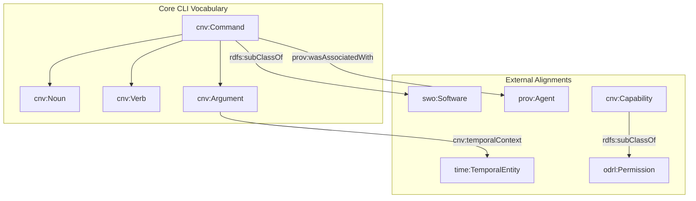

# Semantic CLI Ontology Design Guide

**Status:** Proposed for v6.0 (Phase 2)  
**Timeline:** 2026-06-16 – 2026-06-29

## 1. Introduction: The Semantic CLI Paradigm

A **Semantic Command Line Interface (CLI)** transitions command-line tools from hardcoded string parsers into queryable, introspectable, and machine-comprehensible semantic graphs. In the `clap-noun-verb` framework, CLI structures are modeled using Resource Description Framework (RDF) and Web Ontology Language (OWL) schemas. This allows runtime engines (like Oxigraph) to query command relationships, intents, execution states, and policies using SPARQL.

By formalizing CLI semantics, we enable:
*   **Intent-Based Discovery**: Resolving imprecise user requests (e.g., `myapp ?? "check if database is running"`) to specific command chains (`myapp db status`).
*   **Decoupled Policy & Enforcement**: Verifying command safety constraints using SHACL (Shapes Constraint Language) rather than procedural validation logic.
*   **Agentic Introspection**: Allowing LLMs and external agents to query the CLI capability tree directly via RDF/JSON-LD or MCP (Model Context Protocol).
*   **State-Aware Execution**: Bridging planning (Epistemic state) with execution (Kinetic state) using structured state schemas.

---

## 2. Vocabulary Extensions

To support semantic CLI networks, the `cnv` (Clap-Noun-Verb) and `clnv` namespaces formalize command components, validation constraints, and resource bindings.

### 2.1 Core Namespace and Classes
```turtle
@prefix cnv: <http://clap-noun-verb.dev/ontology#> .
@prefix rdf: <http://www.w3.org/1999/02/22-rdf-syntax-ns#> .
@prefix rdfs: <http://www.w3.org/2000/01/rdf-schema#> .
@prefix xsd: <http://www.w3.org/2001/XMLSchema#> .
@prefix owl: <http://www.w3.org/2002/07/owl#> .
```

The ontology establishes the following foundational classes:

| Class URI | Description | Example Instance |
| :--- | :--- | :--- |
| `cnv:Noun` | A logical category or domain grouping commands. | `ex:services` |
| `cnv:Verb` | An actionable operation performed on a Noun. | `ex:status` |
| `cnv:Command` | The concrete execution path (Noun + Verb). | `ex:services_status` |
| `cnv:Argument` | A parameter, flag, or option passed to a Verb. | `ex:services_status_verbose` |
| `cnv:ReturnType` | The structured schema of the command's output. | `ex:StatusResult` |
| `cnv:Capability` | A security boundary or system permission mapping. | `ex:ReadSystemMetrics` |

### 2.2 Standard Ontology Integration
To avoid reinventing foundational concepts, the semantic CLI integrates mature external ontologies:



1.  **Software Ontology (SWO)** (`http://purl.obolibrary.org/obo/swo.owl`):
    *   *Usage*: Maps CLI tools, versions, and libraries to structured software taxonomy.
    *   *Application*: Ensures that `cnv:Command` aligns with `swo:Software` tool categorization.
2.  **Provenance Ontology (PROV-O)** (`http://www.w3.org/ns/prov#`):
    *   *Usage*: Records command invocation history, execution runs, and state changes.
    *   *Application*: Uses `prov:Activity` to model command runs, and `prov:Agent` for the executing user or AI agent.
3.  **W3C Time Ontology (OWL-Time)** (`http://www.w3.org/2006/time#`):
    *   *Usage*: Defines scheduling bounds, timeouts, and execution durations.
    *   *Application*: `time:Instant` maps runtime execution timestamps; `time:Duration` encodes timeouts.
4.  **Open Digital Rights Language (ODRL)** (`http://www.w3.org/ns/odrl/2/`):
    *   *Usage*: Expresses access control, licensing, policy constraints, and capability boundaries.
    *   *Application*: Maps `cnv:Capability` to `odrl:Permission` and `odrl:Policy` rules.
5.  **Organization Ontology (ORG)** (`http://www.w3.org/ns/org#`):
    *   *Usage*: Maps executing agents to organizational structures, roles, and boundaries.
    *   *Application*: Verifies if the active `prov:Agent` belongs to an `org:Role` permitted to invoke a privileged capability.

---

## 3. State Definition Ontology

A semantic CLI must separate planning (epistemic modeling) from execution (kinetic mutation). This prevents invalid state configurations from mutating underlying system resources.

```
                  ┌────────────────────────────────────────┐
                  │          State Graph (Σ)               │
                  └──────────────────┬─────────────────────┘
                                     │
                        Produces Proposed Changes
                                     │
                                     ▼
                  ┌────────────────────────────────────────┐
                  │         State Overlay (ΔΣ)             │
                  └──────────────────┬─────────────────────┘
                                     │
                         SHACL Validation Pass
                                     │
                                     ▼
                  ┌────────────────────────────────────────┐
                  │       Committed Kinetic Action         │
                  └────────────────────────────────────────┘
```

### 3.1 State Schemas & Overlays (`ΔΣ`)
*   **State Graph ($\Sigma$)**: The read-only semantic representation of the active system state.
*   **State Overlay ($\Delta\Sigma$)**: A collection of proposed changes (triples to add or remove) generated during the planning phase.
*   **Validation Rule**: A state overlay is never applied to the active state ($\Sigma$) until it passes structural integrity validation (SHACL shapes).

### 3.2 Epistemic vs. Kinetic States
*   **Epistemic State**: Represents knowledge, goals, plans, and dry-run outcomes.
    ```turtle
    ex:PlanStep1 a cnv:EpistemicState ;
        cnv:projectedOutcome ex:ExpectedSuccess ;
        cnv:simulatedBy ex:DoctorSimulator .
    ```
*   **Kinetic State**: Represents active system execution, hardware mutations, and committed side effects.
    ```turtle
    ex:ExecutionStep1 a cnv:KineticState ;
        cnv:activeProcessId 90210 ;
        prov:startedAtTime "2026-05-28T19:43:50Z"^^xsd:dateTime .
    ```

### 3.3 SHACL Integrity Shape Example
To ensure every registered command defines an output serialization format, we enforce structural rules via SHACL:

```turtle
@prefix sh: <http://www.w3.org/ns/shacl#> .

cnv:CommandShape a sh:NodeShape ;
    sh:targetClass cnv:Command ;
    sh:property [
        sh:path cnv:hasVerb ;
        sh:minCount 1 ;
        sh:maxCount 1 ;
        sh:class cnv:Verb ;
    ] ;
    sh:property [
        sh:path cnv:returnsType ;
        sh:minCount 1 ;
        sh:class cnv:ReturnType ;
    ] .
```

---

## 4. Command Taxonomy Rules

Strict classification hierarchies prevent command-line bloat and ensure intent discovery remains high-performance.

### 4.1 Hierarchical Noun-Verb Mandate
1.  **Strict Two-Level Depth**: Command paths must follow a strict `[global options] <noun> <verb> [arguments]` structure. Deeply nested command trees (e.g., `myapp system network adapters status`) are prohibited.
2.  **Noun Definition**: Nouns must represent distinct domain models (e.g., `services`, `configs`, `receipts`, `diagnostics`).
3.  **Verb Definition**: Verbs represent actions targeting the parent Noun (e.g., `start`, `stop`, `verify`, `format`).

### 4.2 Intent Mapping (`cnv:intent`)
Verbs must carry descriptive tags (`cnv:intent`) to allow the semantic engine to perform keyword expansion and Jaro-Winkler fallback matching.

```turtle
ex:services_health a cnv:Command ;
    cnv:hasNoun ex:services ;
    cnv:hasVerb ex:health ;
    cnv:intent "status-check", "is-alive", "ping", "diagnostics" .
```

### 4.3 Relationship Modeling
Commands must declare dependencies, conflicts, and contexts to enable compile-time and runtime safety audits:

*   `cnv:dependsOn`: Requires another command or capability to have run or be active.
*   `cnv:conflictsWith`: Prevents concurrent execution.
*   `cnv:relatedTo`: Guides the recommendation engine when a command fails.

---

## 5. Concrete Turtle Example

Below is a complete, production-grade Turtle definition of a semantic `services status` command, modeling arguments, capabilities, and returns.

```turtle
@prefix cnv: <http://clap-noun-verb.dev/ontology#> .
@prefix rdf: <http://www.w3.org/1999/02/22-rdf-syntax-ns#> .
@prefix rdfs: <http://www.w3.org/2000/01/rdf-schema#> .
@prefix xsd: <http://www.w3.org/2001/XMLSchema#> .
@prefix prov: <http://www.w3.org/ns/prov#> .
@prefix swo: <http://purl.obolibrary.org/obo/swo.owl#> .
@prefix odrl: <http://www.w3.org/ns/odrl/2/> .
@prefix ex: <http://example.com/cli#> .

# Noun Class
ex:NounServices a cnv:Noun ;
    rdfs:label "services" ;
    rdfs:comment "Management domain for system services and daemons" .

# Verb Class
ex:VerbStatus a cnv:Verb ;
    rdfs:label "status" ;
    rdfs:comment "Retrieve current health and status metrics" .

# Command Definition
ex:CommandServicesStatus a cnv:Command ;
    rdfs:subClassOf swo:Software ;
    cnv:hasNoun ex:NounServices ;
    cnv:hasVerb ex:VerbStatus ;
    cnv:intent "check-alive", "health-check", "system-health", "ping" ;
    cnv:hasArgument ex:ArgVerbose, ex:ArgServiceId ;
    cnv:returnsType ex:StatusReport ;
    cnv:requiresCapability ex:CapReadMetrics ;
    cnv:dependsOn ex:CommandSystemAuth ;
    rdfs:comment "Exposes detailed status logs and uptime metrics for registered services." .

# Arguments
ex:ArgVerbose a cnv:Argument ;
    cnv:name "verbose" ;
    cnv:type xsd:boolean ;
    cnv:isFlag true ;
    cnv:required false ;
    rdfs:comment "Includes trace-level operational logs in stdout" .

ex:ArgServiceId a cnv:Argument ;
    cnv:name "service_id" ;
    cnv:type xsd:string ;
    cnv:isFlag false ;
    cnv:required true ;
    rdfs:comment "Unique system identifier for the target service" .

# Return Type
ex:StatusReport a cnv:ReturnType ;
    cnv:isSerializable true ;
    cnv:serializationFormat "application/json" ;
    rdfs:comment "Standardized JSON payload representing uptime, CPU, memory, and error count" .

# Capability (ODRL Permission)
ex:CapReadMetrics a cnv:Capability ;
    rdfs:subClassOf odrl:Permission ;
    rdfs:label "ReadMetrics" ;
    rdfs:comment "Grants access to read OS and container metrics" .
```

---

## 6. Integration and Compilation Mechanics

### 6.1 Compile-Time Generation
The macro engine (`#[noun]` and `#[verb]` attributes) extracts Rust doc-comments and structures, emitting embedded Turtle blocks into a linker section:

```rust
/// Management domain for system services and daemons
#[noun]
pub struct Services;

/// Retrieve current health and status metrics
///
/// # Intent: check-alive, health-check, system-health
#[verb]
pub async fn status(
    /// Unique system identifier for the target service
    service_id: String,
    /// Includes trace-level operational logs in stdout
    verbose: bool,
) -> Result<StatusReport> {
    // Execution logic
}
```

This expands during compilation into binary-embedded RDF strings, ensuring documentation, command structures, and semantic data are unified in the final artifact.

### 6.2 Runtime SPARQL Query Patterns
To perform intent-based resolution on a user request:

```sparql
PREFIX cnv: <http://clap-noun-verb.dev/ontology#>
PREFIX rdfs: <http://www.w3.org/2000/01/rdf-schema#>

SELECT ?nounLabel ?verbLabel ?desc WHERE {
    ?cmd a cnv:Command ;
         cnv:hasNoun ?noun ;
         cnv:hasVerb ?verb ;
         cnv:intent ?intent ;
         rdfs:comment ?desc .
    ?noun rdfs:label ?nounLabel .
    ?verb rdfs:label ?verbLabel .
    FILTER(CONTAINS(LCASE(?intent), "health"))
}
```
