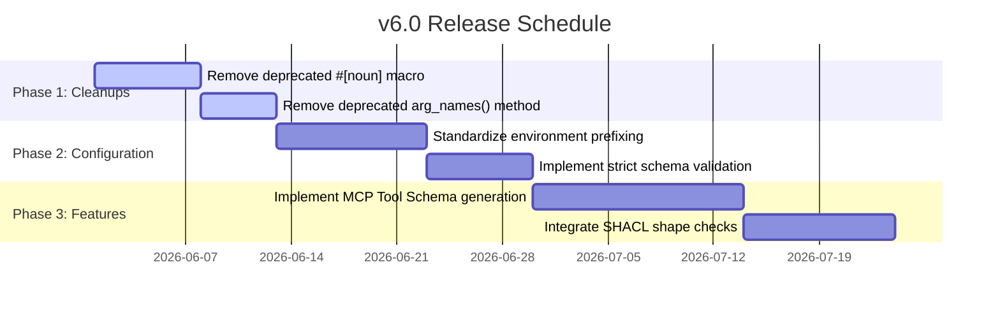

# Major Version v6.0 Breaking Changes & Planning Guide

**Status:** Proposed for v6.0 (Phase 1–2)  
**Timeline:** 2026-06-01 – 2026-06-29

This document details the architectural roadmap, breaking changes, and migration strategies for the major version v6.0 release of the `clap-noun-verb` framework. 

---

## 1. Executive Summary

The v6.0 release represents a consolidation phase aimed at maximizing execution performance, stripping legacy interface layers, and standardizing configuration schemas. Key pillars of this release include:
- **Zero-Boilerplate Subcommands:** Complete removal of the deprecated `#[noun]` attribute macro. Noun identification relies entirely on filename auto-detection and module-level doc comments (`//!`).
- **Zero-Allocation APIs:** Removal of deprecated memory-allocating convenience methods in favor of borrow-centric structures.
- **Layered Configuration Engine:** Formalization of the configuration loading layer with strict schema validation, deterministic merging hierarchies, and standardized environment variable mapping.
- **Advanced Agent Tooling:** Introduction of native Model Context Protocol (MCP) schema reflection and compile-time SHACL validation.

---

## 2. Removal of Deprecated Attributes & APIs

### 2.1 Complete Removal of the `#[noun]` Attribute Macro
The `#[noun]` attribute was deprecated in v5.6.0 as a no-op that emitted compile-time deprecation warnings. In v6.0, it is completely removed from the framework codebase.

* **Impacted Codebase Locations:**
  - `clap-noun-verb-macros/src/lib.rs`: The `pub fn noun` proc macro definition and its parsing logic are removed.
  - `src/lib.rs` and `src/noun.rs`: Removal of any conditional checks or legacy references to macro-generated noun structs.
* **Migration Pattern:**
  Developers must delete the `#[noun]` attribute macro entirely. Nouns are auto-detected by the framework from the filename (e.g., `src/commands/config.rs` registers the `config` noun) or via explicit parameters in the `#[verb]` attribute macro (e.g., `#[verb("set", "config")]`).

```diff
- #[noun(name = "config", about = "Manage application configuration")]
- pub fn config_noun() {}
-
  #[verb("set")]
  pub fn set_config(key: String, value: String) -> Result<()> {
      // ...
  }
```

### 2.2 Removal of `VerbArgs::arg_names()`
To avoid unnecessary memory allocations, the deprecated `arg_names()` method returning `Vec<String>` is removed in favor of `arg_names_refs()` returning `Vec<&str>`.

* **Impacted Crate Module:** `src/verb.rs`
* **Migration Pattern:**
  Replace all invocations of `arg_names()` with `arg_names_refs()`.

```diff
- let names: Vec<String> = verb_args.arg_names();
+ let names: Vec<&str> = verb_args.arg_names_refs();
```

### 2.3 Strict Enforcement of Inline `#[arg]` Whitelist
Legacy, undocumented parameters in inline `#[arg]` attributes (like raw clap overrides that bypass the type checking layer) are removed. The macro preprocessor will now trigger compile-time errors for any undocumented `#[arg]` parameters that do not exist in the explicit whitelist.

---

## 3. Breaking Configuration Updates

The configuration engine receives a major overhaul in v6.0 to support reliable agentic execution and deterministic setting resolution.

### 3.1 Unification of the Configuration Engine
The new configuration layer merges settings from five distinct sources in a strict priority order (highest to lowest):
1. **Explicit Command Line Arguments:** E.g., `--host 127.0.0.1`
2. **Environment Variables:** E.g., `CNV_HOST=127.0.0.1`
3. **Project-Local Config File:** `clap-nv.toml` or `clap-nv.yaml` (automatically discovered in the working directory or parent workspace directory)
4. **User-Global Config File:** `~/.config/clap-nv/config.toml`
5. **Crate / Application Defaults:** Declared via doc-comment tags `[default:]`

### 3.2 Standardized Environment Variable Prefixing
Environment variables will be automatically bound to configuration keys. In v6.0, the framework enforces a unified, customizable environment prefix to prevent namespace pollution.
- **Default Prefix:** `CNV_`
- Dotted paths in config structures translate to double underscores in environment variables (e.g., `database.connection_timeout` becomes `CNV_DATABASE__CONNECTION_TIMEOUT`).

### 3.3 Strict Schema Validation
To prevent silent configuration failures, the configuration loader in v6.0 requires strict schema validation. If `clap-nv.toml` contains keys that do not correspond to registered arguments or nested configuration structures, the preprocessor will abort with a structured error of kind `ErrorKind::InvalidConfiguration`.

```toml
# clap-nv.toml - v6.0 Strict Schema Example
[server]
host = "127.0.0.1"
port = 8080

[database]
url = "postgres://localhost/db"
# Invalid keys (like typoed "poolsize = 10") will trigger immediate initialization failures
pool_size = 10 
```

---

## 4. Major Feature Proposals

### 4.1 Native Model Context Protocol (MCP) Integration
To support seamless orchestration by autonomous agents, v6.0 introduces a built-in MCP metadata exporter. 

* **Compile-Time Tool Schemas:** The `#[verb]` macro will automatically generate JSON schema payloads complying with the MCP Tool definition format.
* **Introspection Endpoint:** A built-in command `mcp-schema` exposes all registered nouns and verbs as an array of JSON-Schema tools, allowing LLM hosts to immediately consume the CLI as tool declarations.

### 4.2 Compile-Time and Runtime SHACL Validation
For systems building on RDF/SPARQL/Ontology-driven capabilities, v6.0 introduces an optional feature flag `validation-shacl`.
* **Admissibility Guards:** Incoming inputs to verbs representing structured types are checked against SHACL shape constraints before handler execution.
* **Semantic Verification:** Prevents invalid command execution by validating arguments directly against an RDF graph topology definition.

### 4.3 Second-Order Autonomic Tuning
The telemetry and monitoring layer adds native support for the Meta-MAPE-K loop.
* **Dynamic Stability Regulation:** Command execution performance metrics, error rates, and duration spikes are tracked in a thread-safe telemetry buffer.
* **Self-Healing Adjustments:** If anomaly thresholds are breached, the autonomic middleware can trigger safety policies (e.g., enabling rate limiting or switching to fallback parameters) without restarting the CLI process.

---

## 5. Developer Migration Checklist

| Action Item | Legacy Code (v5.x) | Modern Code (v6.0) |
|---|---|---|
| **Noun Declaration** | `#[noun("auth", "Auth module")]` | Remove the attribute macro entirely; use filename `auth.rs` and `//! Auth module` doc comments. |
| **Argument Names** | `verb_args.arg_names()` | `verb_args.arg_names_refs()` |
| **Environment Variable** | `#[arg(env = "APP_PORT")]` | Enforce unified prefix routing via `CNV_PORT` or custom prefixes registered on the builder. |
| **Configuration Loading** | Manual custom file parsing | Unified automated parsing via `ConfigLoader` integration with strict schema checking. |

---

## 6. Implementation Timeline


