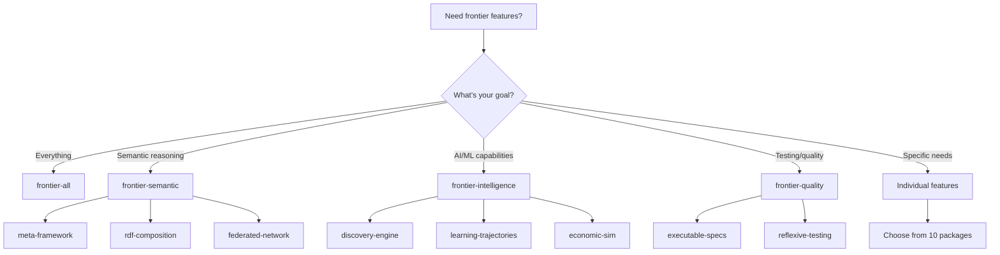

# Frontier Feature Selection Guide

## Overview

Frontier packages provide 10 advanced agent-grade capabilities for building sophisticated CLI systems. This guide helps you select the right features for your use case.

## Three-Tier Feature Architecture

### Tier 1: Meta-Features (Convenience Bundles)

Meta-features enable multiple related packages at once:

```toml
[dependencies]
# All frontier features
clap-noun-verb = { version = "5.4", features = ["frontier-all"] }

# Semantic and networking features
clap-noun-verb = { version = "5.4", features = ["frontier-semantic"] }

# AI/ML and discovery features
clap-noun-verb = { version = "5.4", features = ["frontier-intelligence"] }

# Testing and verification features
clap-noun-verb = { version = "5.4", features = ["frontier-quality"] }
```

### Tier 2: Individual Features (10 Packages)

Enable specific frontier packages as needed:

| Feature | Description | Dependencies | Use When |
|---------|-------------|--------------|----------|
| `meta-framework` | Self-modifying agent frameworks | erased-serde, typetag, inventory, paste | Building plugin systems, runtime command composition |
| `rdf-composition` | Semantic ontology composition | oxrdf, oxigraph, json-ld, sophia_api | Need semantic reasoning, SPARQL queries, MCP integration |
| `executable-specs` | BDD specifications | cucumber, gherkin, libtest-mimic | Writing behavior-driven tests, living documentation |
| `fractal-patterns` | Self-similar hierarchies | petgraph, daggy, slotmap | Recursive command structures, graph-based CLIs |
| `discovery-engine` | Dynamic capability discovery | tower, tower-service, http | Service-oriented architecture, runtime capability queries |
| `federated-network` | Multi-host coordination | libp2p, quinn, rustls | Distributed CLIs, peer-to-peer agent networks |
| `learning-trajectories` | ReasoningBank learning | ndarray, smartcore, linfa | Self-learning CLIs, pattern recognition |
| `reflexive-testing` | Self-testing systems | quickcheck, arbitrary | Property-based testing, invariant checking |
| `economic-sim` | Agent economy simulations | priority-queue, ordered-float, petgraph | Resource allocation, agent economies |
| `quantum-ready` | Post-quantum cryptography | pqcrypto-traits, pqcrypto-kyber | Future-proof security, quantum resistance |

### Tier 3: Shared Infrastructure

Frontier features build on existing clap-noun-verb features:

- `async` - Required by `discovery-engine`, `federated-network`
- `crypto` - Required by `quantum-ready`
- `rdf` - Required by `rdf-composition`
- `agent2028` - Trillion-agent ecosystem support

## Decision Tree



## Dependency Impact Matrix

### Binary Size Impact (approximate)

| Feature Combination | Binary Size | Dependencies | Compile Time |
|---------------------|-------------|--------------|--------------|
| Minimal (no frontiers) | ~5MB | 10 crates | ~30s |
| frontier-quality | ~8MB | +6 crates | +15s |
| frontier-semantic | ~15MB | +12 crates | +45s |
| frontier-intelligence | ~12MB | +9 crates | +30s |
| frontier-all | ~25MB | +30 crates | +90s |

### Feature Compatibility Matrix

| Feature | Requires async | Requires crypto | Requires rdf | Compatible with |
|---------|---------------|-----------------|--------------|-----------------|
| meta-framework | No | No | No | All |
| rdf-composition | No | No | Yes | All |
| executable-specs | No | No | No | All |
| fractal-patterns | No | No | No | All |
| discovery-engine | Yes | No | No | All |
| federated-network | Yes | No | No | discovery-engine |
| learning-trajectories | No | No | No | All |
| reflexive-testing | No | No | No | executable-specs |
| economic-sim | No | No | No | All |
| quantum-ready | No | Yes | No | All |

## Common Use Cases

### 1. Semantic Agent CLI

```toml
features = ["frontier-semantic", "agent2028"]
```

Enables:
- Self-modifying frameworks
- RDF/SPARQL reasoning
- P2P agent coordination
- MCP protocol integration

### 2. Self-Learning CLI

```toml
features = ["frontier-intelligence", "agent2028"]
```

Enables:
- Dynamic capability discovery
- Pattern learning
- Economic resource allocation
- Agent optimization

### 3. High-Quality Testing

```toml
features = ["frontier-quality"]
```

Enables:
- BDD specifications
- Property-based testing
- Self-verification
- Living documentation

### 4. Production-Grade Security

```toml
features = ["quantum-ready", "crypto", "agent2028"]
```

Enables:
- Post-quantum cryptography
- Secure agent identities
- Future-proof signatures
- Quantum-resistant receipts

## Performance Considerations

### SLO Impact

| Feature | Startup Overhead | Memory Overhead | Runtime Impact |
|---------|------------------|-----------------|----------------|
| meta-framework | <10ms | ~2MB | Minimal |
| rdf-composition | <50ms | ~5MB | Low (cached) |
| executable-specs | <5ms | ~1MB | Test-only |
| fractal-patterns | <5ms | ~1MB | Minimal |
| discovery-engine | <20ms | ~3MB | Low |
| federated-network | <100ms | ~8MB | Network-bound |
| learning-trajectories | <30ms | ~10MB | Medium (ML) |
| reflexive-testing | <5ms | ~1MB | Test-only |
| economic-sim | <10ms | ~2MB | Low |
| quantum-ready | <50ms | ~4MB | High (crypto) |

### Optimization Tips

1. **Start minimal**: Only enable features you need
2. **Use meta-features**: Reduce configuration with bundles
3. **Profile first**: Measure before optimizing
4. **Consider async**: Enable for network/IO-heavy workloads
5. **Test combinations**: Verify feature interactions

## Testing Feature Combinations

### Using cargo-make

```bash
# Test minimal build
cargo make check-frontier-minimal

# Test all features
cargo make check-frontier-all

# Test specific meta-feature
cargo test --features frontier-semantic

# Verify all combinations
cargo make verify-frontier
```

### CI/CD Integration

See `.github/workflows/ci.yml` for feature matrix testing:

```yaml
strategy:
  matrix:
    features:
      - ""  # Minimal
      - "frontier-all"
      - "frontier-semantic"
      - "frontier-intelligence"
      - "frontier-quality"
      # ... individual features
```

## Migration Guide

### From v5.3 to v5.4

No breaking changes - frontier features are purely additive:

```diff
[dependencies]
- clap-noun-verb = "5.3"
+ clap-noun-verb = { version = "5.4", features = ["frontier-semantic"] }
```

### Incremental Adoption

1. Start with minimal features
2. Add one frontier feature at a time
3. Test compilation and behavior
4. Measure performance impact
5. Iterate based on needs

## Troubleshooting

### Compilation Errors

**Problem**: Feature compilation fails

**Solution**:
```bash
# Clean build
cargo clean

# Check specific feature
cargo check --features meta-framework

# Verify dependencies
cargo tree --features frontier-all
```

### Binary Size Too Large

**Problem**: Binary size exceeds limits

**Solution**:
1. Use specific features instead of `frontier-all`
2. Enable LTO in release profile
3. Strip debug symbols
4. Use minimal feature combinations

### Slow Compilation

**Problem**: Compilation takes too long

**Solution**:
1. Use sccache for caching
2. Enable incremental compilation
3. Reduce parallel jobs (`-j4`)
4. Use workspace exclusions

## Support

- **Documentation**: https://docs.rs/clap-noun-verb
- **Repository**: https://github.com/seanchatmangpt/clap-noun-verb
- **Issues**: https://github.com/seanchatmangpt/clap-noun-verb/issues

## Version History

- **v5.4.0** - Phase 1: Frontier feature architecture
- **v5.3.4** - Agent2028 and RDF foundations
- **v5.0.0** - Kernel capabilities

---

**Next Steps**: After selecting features, see the [Frontier API Documentation](https://docs.rs/clap-noun-verb/latest/clap_noun_verb/frontier/) for usage examples.
