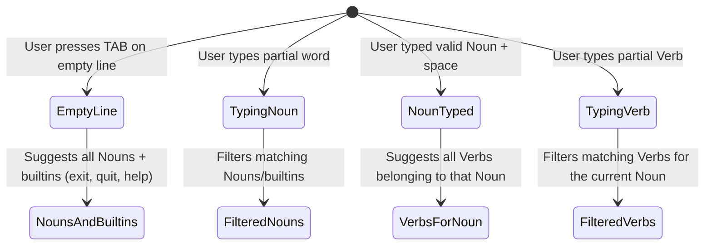

# Interactive REPL Mode in `clap-noun-verb`

`clap-noun-verb` supports a fully featured, interactive REPL (Read-Eval-Print Loop) shell mode. This mode allows users to run commands sequentially in a state-aware shell environment with advanced terminal line-editing capabilities, context-sensitive tab autocompletion, and persistent command history.

The interactive REPL is powered by the `rustyline` library and is gated behind the `repl` Cargo feature.

---

## 1. Enabling the REPL Feature

To use the REPL mode in your project, enable the `repl` feature flag in your `Cargo.toml`:

```toml
[dependencies]
clap-noun-verb = { version = "0.5.4", features = ["repl"] }
```

When this feature is disabled, `clap-noun-verb` compiles with a lightweight stub implementation of the `Repl` struct that returns an error if `run()` is called, preventing unnecessary dependencies from bloating your binary size.

---

## 2. API Usage & Configuration

To integrate the REPL into your Rust application, use the `Repl` struct. You instantiate it with your command registry and optionally configure a history file.

### Basic Initialization Example

```rust
use clap_noun_verb::{CommandRegistry, Repl};
use std::path::PathBuf;

fn main() -> clap_noun_verb::Result<()> {
    // 1. Initialize the CommandRegistry and register commands
    let mut registry = CommandRegistry::new();
    
    // (Assume nouns and verbs are registered here)

    // 2. Configure the REPL runner
    let history_path = dirs::home_dir()
        .map(|h| h.join(".myapp_history"))
        .unwrap_or_else(|| PathBuf::from(".myapp_history"));

    let repl = Repl::new(registry)
        .with_history_file(history_path);

    // 3. Start the interactive loop
    // This will block until the user exits or sends a termination signal
    repl.run()?;

    Ok(())
}
```

### The `Repl` API Reference

- **`Repl::new(registry: CommandRegistry) -> Self`**  
  Creates a new REPL shell execution helper tied to the given `CommandRegistry`.
- **`Repl::with_history_file(self, path: PathBuf) -> Self`**  
  Sets the destination file where the command history will be stored and loaded from.
- **`Repl::registry(&self) -> &CommandRegistry`**  
  Returns a reference to the underlying `CommandRegistry`.
- **`Repl::run(&self) -> Result<()>`**  
  Starts the interactive execution loop. If the `repl` feature is disabled, this returns a `Result::Err` notifying the developer to compile with the `repl` feature.

---

## 3. Interactive Prompts & Built-in Commands

When the REPL is started, it prints a welcome banner:

```text
Welcome to the <app_name> interactive REPL shell.
Type 'help' to see available commands, or 'exit' / 'quit' to exit.
```

### The Prompt

The prompt is dynamically formatted based on the name of the executable configured in the `CommandRegistry`:

```text
<app_name>> 
```

### Built-in Shell Commands

The REPL environment intercept and processes several built-in commands natively:

1. **`help`**  
   Prints the auto-generated global CLI help screen (listing nouns and global arguments) to standard output.
2. **`exit`** or **`quit`**  
   Gracefully terminates the REPL loop, saves the session history, and returns control to the calling process.
3. **`CTRL-C` (Interrupt Signal)**  
   Halts the current line editing. If pressed on an empty prompt, it exits the REPL session immediately.
4. **`CTRL-D` (EOF / End-Of-File)**  
   Gracefully exits the REPL session (equivalent to `exit`).

---

## 4. Shell-Word Parsing & Command Routing

Unlike standard command-line execution where the shell handles argument parsing and quotes, a REPL receives inputs as raw strings. `clap-noun-verb` processes this string to ensure arguments behave exactly as they would on a standard CLI.

### Parsing Engine: `split_shell_words`

The interactive loop uses a specialized shell tokenizer (`split_shell_words`) to parse inputs:
- **Whitespace Splitting**: Treats spaces as argument delimiters.
- **Quote Preservation**: Correctly handles single (`'...'`) and double (`"..."`) quotes, allowing arguments containing spaces (e.g. `noun verb "arg with spaces"`).
- **Escape Sequences**: Supports backslash escapes (`\`) to include literal spaces, quotes, or control characters.
- **Syntax Validation**: Returns an error if unmatched quotes or hanging escape characters are detected, prompting the user without executing malformed commands.

### Command Execution Parity

After tokenizing the input string into a vector of arguments:
1. The REPL prepends the binary app name as the first argument (`argv[0]`), maintaining parity with standard CLI invocation expectations.
2. The argument vector is evaluated against the `clap::Command` structure using `try_get_matches_from()`.
3. If matches are successful, they are routed to the registered handlers via `CommandRegistry::route(&matches)`.
4. Standard error output and help messages generated by parser mismatches are caught and printed to the terminal, keeping the shell running.

---

## 5. Tab Autocompletion & Context-Sensitive Helper

The REPL utilizes a custom `rustyline` helper structure (`ReplHelper`) to provide state-aware autocompletion when the user presses the `TAB` key.



### Autocomplete States

- **Empty Line or Start of Word**: Pressing `TAB` suggests all registered **Nouns** in the command registry, along with the built-in commands (`help`, `exit`, `quit`).
- **Partial Noun Matching**: If a user types part of a noun (e.g., `pa`) and presses `TAB`, it completes or lists matching nouns (e.g., `pack`, `paths`).
- **Contextual Verb Selection**: If a valid noun is entered followed by a space, pressing `TAB` suggests only the **Verbs** associated with that specific noun, preventing suggestions of unrelated verbs.
- **Partial Verb Matching**: Filters verbs dynamically as characters are typed (e.g., `pack in` completes to `pack install`).

---

## 6. History Tracking

To enhance usability, command history is preserved both in-memory and across runs:

- **Navigation**: Users can scroll through past commands using the `<Up>` and `<Down>` arrow keys.
- **Startup Loading**: When `Repl::run()` is called, it checks if the configured history file exists and attempts to load it. If loading fails, a warning is printed to `stderr` but the REPL session starts normally.
- **Automatic Saving**: Upon a graceful exit (`exit`, `quit`, `CTRL-D`, or `CTRL-C`), the history is saved to the designated file.
- **Directory Verification**: Before writing the history file, the REPL automatically creates any missing parent directories of the file path.
- **Deduplication and Cleanup**: Empty inputs are automatically ignored and not added to the command history.

---

## 7. Configuration Best Practices

- **Feature-Gating**: If your application does not require REPL functionality in all builds, keep the feature optional to decrease compilation times and binary footprint.
- **TTY Check**: Before running `repl.run()`, ensure your application is running in an interactive terminal. Running a REPL under standard piping (`stdout` redirection) can lead to infinite loops or unexpected behavior.
- **Error Control**: By using `try_get_matches_from`, internal parsing errors are intercepted, meaning bad commands won't cause the shell process to crash.
