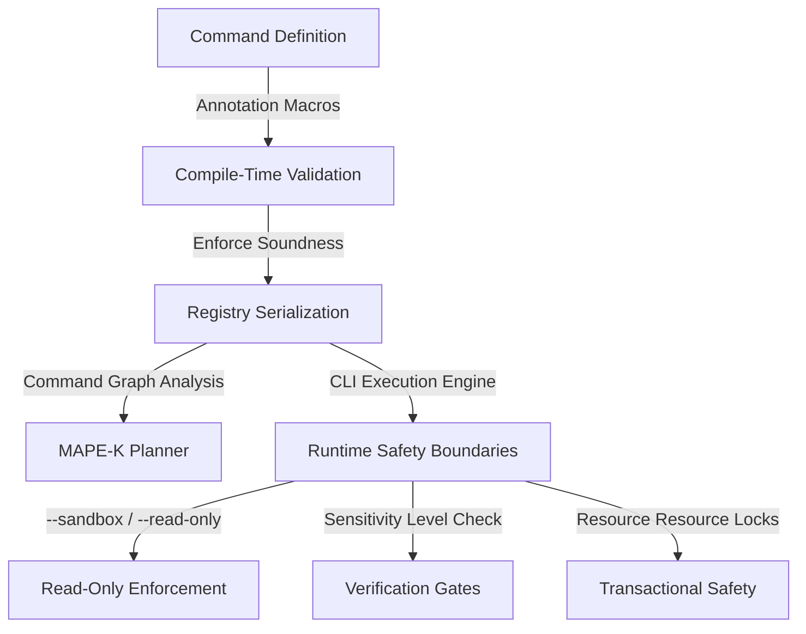

# Effect Metadata Design Guide

This guide defines the design, semantics, and implementation requirements for **Effect Metadata** in the `clap-noun-verb` framework. Effect Metadata provides a declarative, statically validated, and runtime-enforced system for annotating the side effects of CLI commands. This enables the framework to run commands safely, analyze operational risk, construct command execution graphs, and feed telemetry into autonomic MAPE-K (Monitor-Analyze-Plan-Execute-Knowledge) loops.

---

## 1. Architectural Overview

Effect Metadata bridges the gap between static CLI declarations and active runtime safety. By explicitly defining the side effects of every noun-verb command, the framework can:
- **Statically check** that commands declare their resource scopes and follow safety constraints at compile time.
- **Isolate execution** at runtime, preventing state mutations in sandbox or read-only modes.
- **Enforce guard rails** automatically, requiring confirmation gates for high-sensitivity operations.
- **Construct execution graphs** (DAGs) to prevent concurrent mutation conflicts on overlapping resources.



---

## 2. Side-Effects Annotation

Side effects are annotated using either declarative procedural macros or a programmatic builder pattern. Each command declares its `EffectType`, its `Sensitivity` level, and the specific resources it targets.

### A. Core Types and Semantics

The type system defines the vocabulary of effects and resource scopes:

```rust
/// The type of side effect a command performs on the system.
#[derive(Debug, Clone, Copy, PartialEq, Eq, serde::Serialize, serde::Deserialize)]
pub enum EffectType {
    /// No mutation or state changes are performed. Safe to run concurrently.
    ReadOnly,
    /// Mutates runtime memory, active processes, or transient state.
    MutateState,
    /// Mutates persistent system configuration files or database settings.
    MutateConfig,
    /// Mutates structural definitions, schemas, or ontology frameworks.
    MutateOntology,
    /// Alters security controls, user permissions, or cryptographic keys.
    MutateSecurity,
}

/// The impact and risk level associated with executing the command.
#[derive(Debug, Clone, Copy, PartialEq, Eq, PartialOrd, Ord, serde::Serialize, serde::Deserialize)]
pub enum Sensitivity {
    /// No risk or minimal impact (e.g., viewing help or basic status checks).
    Low,
    /// Moderate impact (e.g., viewing logs, safe non-destructive state changes).
    Medium,
    /// Significant impact (e.g., service restarts, configuration edits).
    High,
    /// Severe impact potential (e.g., database schema migrations, wiping data, altering keys).
    Critical,
}

/// Identifies a specific system resource or namespace targeted by an effect.
#[derive(Debug, Clone, PartialEq, Eq, serde::Serialize, serde::Deserialize)]
pub struct ResourceTarget {
    /// The scheme or protocol of the resource (e.g., "db", "config", "sys").
    pub scheme: String,
    /// The specific path or identifier of the targeted resource (e.g., "users/table").
    pub path: String,
}

impl ResourceTarget {
    /// Creates a new ResourceTarget from its component strings.
    pub fn new(scheme: impl Into<String>, path: impl Into<String>) -> Self {
        Self {
            scheme: scheme.into(),
            path: path.into(),
        }
    }
}
```

### B. Programmatic Definition Builder

For manual command construction, metadata is declared via a builder pattern:

```rust
use std::collections::HashSet;

#[derive(Debug, Clone, serde::Serialize, serde::Deserialize)]
pub struct EffectMetadata {
    pub effect_type: EffectType,
    pub sensitivity: Sensitivity,
    pub targets: Vec<ResourceTarget>,
}

impl EffectMetadata {
    pub fn new(effect_type: EffectType) -> Self {
        Self {
            effect_type,
            sensitivity: Sensitivity::Low,
            targets: Vec::new(),
        }
    }

    pub fn with_sensitivity(mut self, sensitivity: Sensitivity) -> Self {
        self.sensitivity = sensitivity;
        self
    }

    pub fn targeting_resource(mut self, scheme: &str, path: &str) -> Self {
        self.targets.push(ResourceTarget::new(scheme, path));
        self
    }
}
```

### C. Macro-Based Declarative Annotation

Declarative macro support allows developers to attach metadata cleanly directly to the command definitions:

```rust
// Macro-based attribute example for compile-time generation
#[verb(
    name = "migrate",
    about = "Run database schema migrations",
    effect = "MutateOntology",
    sensitivity = "Critical",
    resources = ["db://system_tables", "db://user_tables"]
)]
pub struct MigrateDbVerb;
```

---

## 3. Compile-Time Metadata Validation

To ensure structural completeness and prevent invalid configurations from reaching production, procedural macros analyze the declared metadata at compile time.

### A. Static Constraint Audits
During compilation, the `#[verb]` macro enforces the following semantic rules:
1. **Resource Consistency**: If a command is declared `ReadOnly`, it cannot specify any mutating target resources (e.g. `db://...` in write mode).
2. **Missing Metadata Warnings/Errors**: Commands that mutate state must declare at least one resource target.
3. **Safety Implementation Requirements**: Any command marked with `Sensitivity::Critical` must implement the `InteractiveConfirmation` trait or declare an explicit safety bypass flag.

### B. Procedural Macro Implementation Blueprint

Below is the design pattern for the procedural macro validation logic:

```rust
// Conceptual implementation of the compile-time validation check in the macro crate
extern crate proc_macro;
use proc_macro::TokenStream;
use quote::quote;
use syn::{parse_macro_input, AttributeArgs, DeriveInput, Meta, NestedMeta, Lit};

pub fn validate_verb_attributes(args: AttributeArgs) -> Result<(), String> {
    let mut effect_type = None;
    let mut sensitivity = None;
    let mut resources = Vec::new();

    for arg in args {
        if let NestedMeta::Meta(Meta::NameValue(nv)) = arg {
            if nv.path.is_ident("effect") {
                if let Lit::Str(lit) = nv.lit {
                    effect_type = Some(lit.value());
                }
            } else if nv.path.is_ident("sensitivity") {
                if let Lit::Str(lit) = nv.lit {
                    sensitivity = Some(lit.value());
                }
            }
        } else if let NestedMeta::Meta(Meta::List(ml)) = arg {
            if ml.path.is_ident("resources") {
                for nested in ml.nested {
                    if let NestedMeta::Lit(Lit::Str(lit)) = nested {
                        resources.push(lit.value());
                    }
                }
            }
        }
    }

    // Validation Rule 1: ReadOnly commands cannot declare resource targets in mutating patterns
    if let Some(ref eff) = effect_type {
        if eff == "ReadOnly" && !resources.is_empty() {
            // ReadOnly commands only read state; if they target resources, it must be read-only scopes.
            for res in &resources {
                if res.contains("::write") || res.contains("::delete") {
                    return Err(format!(
                        "Validation Error: Command declared as ReadOnly but references write-access resource: {}",
                        res
                    ));
                }
            }
        }
    }

    // Validation Rule 2: Critical commands must configure a safety sensitivity profile
    if let Some(ref sens) = sensitivity {
        if sens == "Critical" && (effect_type.is_none() || effect_type.as_deref() == Some("ReadOnly")) {
            return Err("Validation Error: Critical sensitivity requires a mutating effect type.".to_string());
        }
    }

    Ok(())
}
```

---

## 4. Runtime Safety Boundaries

At runtime, the execution engine validates commands against the active execution context and environment flags.

### A. Read-Only and Sandbox Modes

When the CLI is invoked with a safety flag like `--read-only` or `--sandbox`, the framework blocks execution of any command that modifies state:

```rust
use std::fmt;

#[derive(Debug)]
pub enum SafetyError {
    SandboxViolation { command: String, effect: EffectType },
    MissingConfirmation { command: String, level: Sensitivity },
    ResourceConflict { resource: String, command_a: String, command_b: String },
}

impl fmt::Display for SafetyError {
    fn fmt(&self, f: &mut fmt::Formatter<'_>) -> fmt::Result {
        match self {
            Self::SandboxViolation { command, effect } => {
                write!(f, "Safety Violation: Command '{}' requests effect '{:?}' in sandbox mode.", command, effect)
            }
            Self::MissingConfirmation { command, level } => {
                write!(f, "Safety Violation: Command '{}' requires confirmation (sensitivity level: {:?}). Use --force to override.", command, level)
            }
            Self::ResourceConflict { resource, command_a, command_b } => {
                write!(f, "Resource Conflict: '{}' and '{}' concurrently access resource '{}'.", command_a, command_b, resource)
            }
        }
    }
}

impl std::error::Error for SafetyError {}

pub struct RuntimeSafetyGate {
    pub is_sandbox: bool,
    pub force_execution: bool,
}

impl RuntimeSafetyGate {
    pub fn verify_execution(&self, command_name: &str, metadata: &EffectMetadata) -> Result<(), SafetyError> {
        // Enforce Sandbox check
        if self.is_sandbox && metadata.effect_type != EffectType::ReadOnly {
            return Err(SafetyError::SandboxViolation {
                command: command_name.to_string(),
                effect: metadata.effect_type,
            });
        }

        // Enforce Sensitivity confirmation requirement
        if metadata.sensitivity >= Sensitivity::High && !self.force_execution {
            return Err(SafetyError::MissingConfirmation {
                command: command_name.to_string(),
                level: metadata.sensitivity,
            });
        }

        Ok(())
    }
}
```

### B. Command Graph Conflict Detection

Using effect metadata targets, the execution engine analyzes command lists before execution to detect race conditions or resource corruption:

```rust
pub struct ExecutionPlanner;

impl ExecutionPlanner {
    /// Detects if two commands have conflicting effects on overlapping resources.
    pub fn has_conflict(
        cmd_a_name: &str,
        meta_a: &EffectMetadata,
        cmd_b_name: &str,
        meta_b: &EffectMetadata,
    ) -> Option<SafetyError> {
        // ReadOnly vs ReadOnly: Never conflicts
        if meta_a.effect_type == EffectType::ReadOnly && meta_b.effect_type == EffectType::ReadOnly {
            return None;
        }

        // Check for target overlap where at least one is writing
        for target_a in &meta_a.targets {
            for target_b in &meta_b.targets {
                if target_a == target_b {
                    return Some(SafetyError::ResourceConflict {
                        resource: format!("{}://{}", target_a.scheme, target_a.path),
                        command_a: cmd_a_name.to_string(),
                        command_b: cmd_b_name.to_string(),
                    });
                }
            }
        }

        None
    }
}
```

---

## 5. Practical Implementation Examples

### A. Example 1: Read-Only System Check

An observation verb that checks disk space. Safe to run in any mode.

```rust
pub struct CheckDiskVerb;

impl CheckDiskVerb {
    pub fn name(&self) -> &'static str { "check" }
    pub fn about(&self) -> &'static str { "Check disk availability" }

    pub fn metadata(&self) -> EffectMetadata {
        EffectMetadata::new(EffectType::ReadOnly)
            .with_sensitivity(Sensitivity::Low)
            .targeting_resource("sys", "storage/disk")
    }

    pub fn run(&self) -> Result<(), Box<dyn std::error::Error>> {
        println!("Disk usage is within acceptable limits.");
        Ok(())
    }
}
```

### B. Example 2: High Sensitivity Database Reset

A command that deletes data. Blocked in sandbox mode, requires confirmation gate.

```rust
pub struct ResetDatabaseVerb;

impl ResetDatabaseVerb {
    pub fn name(&self) -> &'static str { "reset" }
    pub fn about(&self) -> &'static str { "Reset the database to clean schema" }

    pub fn metadata(&self) -> EffectMetadata {
        EffectMetadata::new(EffectType::MutateOntology)
            .with_sensitivity(Sensitivity::Critical)
            .targeting_resource("db", "relational/primary")
    }

    pub fn run(&self, safety_gate: &RuntimeSafetyGate) -> Result<(), Box<dyn std::error::Error>> {
        // Enforce the checks before executing
        safety_gate.verify_execution(self.name(), &self.metadata())?;

        println!("Database has been successfully reset.");
        Ok(())
    }
}
```

---

## 6. Integration Roadmap

1. **Phase 1: Typestate Definition & Validation Macros**
   Implement the standard `EffectType`, `Sensitivity`, and `ResourceTarget` structures under `clap_noun_verb::autonomic::effects` alongside compile-time structural macro checks.

2. **Phase 2: Registry Introspection**
   Expose effect metadata fields in CLI schemas and the outputs of `--introspect` and `--graph`.

3. **Phase 3: Runtime Sandbox Hook**
   Add `--sandbox` and `--read-only` flags to the global runner to evaluate commands prior to handler routing.
