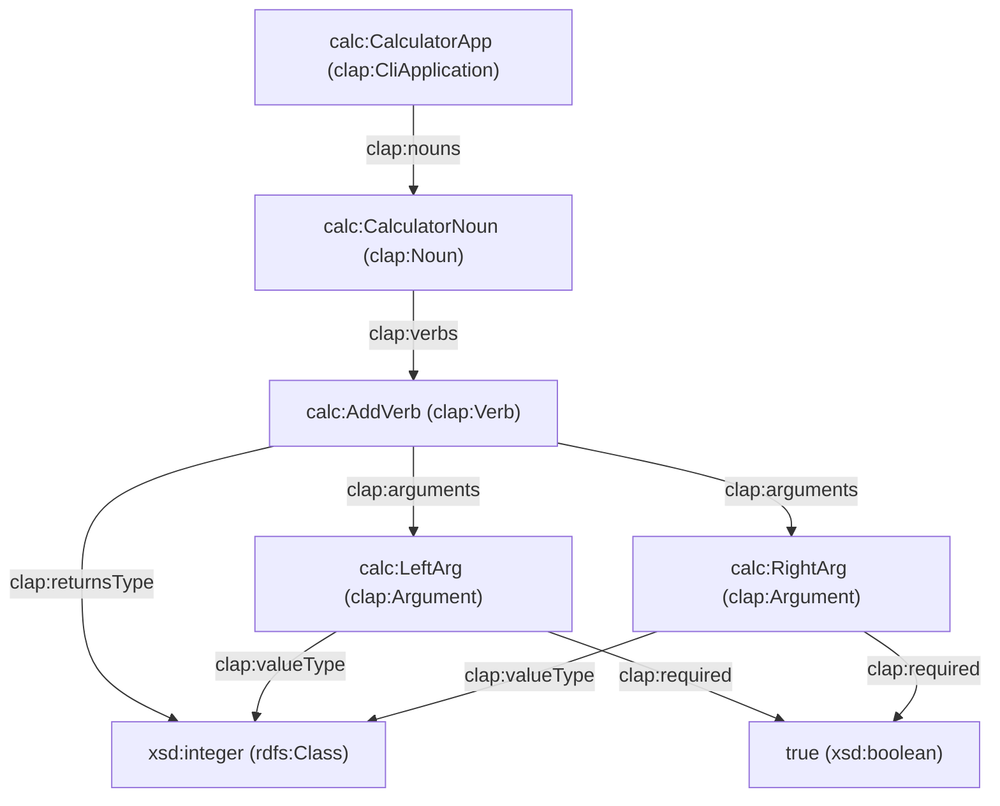

# Semantic CLI Patterns: CLI-as-a-Knowledge-Graph & Semantic Web Integration

This document outlines the architectural patterns, conceptual models, and technical integration specifications for defining Command Line Interfaces (CLIs) as Semantic Knowledge Graphs. By moving from purely text-based syntactic parsing to machine-queryable semantic representations, CLIs become autonomous, self-documenting interfaces optimized for both human developers and artificial intelligence agents.

---

## 1. The Paradigm Shift: Syntactic vs. Semantic CLIs

Traditional CLIs represent commands as nested syntax trees parsed through string matching. While effective for humans, these interfaces lack formal machine-readable semantics, forcing AI agents and automation scripts to resort to fragile regular expressions, string scraping of `--help` screens, or manual JSON mapping.

| Dimension | Syntactic CLI (Traditional) | Semantic CLI (Knowledge Graph) |
|---|---|---|
| **Representation** | String patterns, nested Command trees | RDF (Resource Description Framework) Graph |
| **Parsing** | POSIX argument parsing (e.g., standard `clap`) | Graph-matching against SHACL validation shapes |
| **Discovery** | Scrolling `--help` text, shell tab-completion | SPARQL querying on intent, capabilities, and relations |
| **Agent Integration**| Hardcoded wrapper scripts, regex help parsing | Standard JSON-LD contexts, Model Context Protocol (MCP) |
| **Extensibility** | Manual code edits for command nesting | Logical graph triples joining disparate domains |

---

## 2. CLI-as-a-Knowledge-Graph Concept

In the Semantic CLI model, every aspect of the command-line interface—from nouns and verbs to arguments, types, constraints, and runtime executions—is modeled as a node (resource) in a directed, labeled knowledge graph.

### Graph Architecture Diagram



### Core Node Types and Relations

The ontology defines a set of distinct entity classes:

1. **`clap:CliApplication`**: The root container representing the compiled binary, its metadata (version, author, name), and its entry points.
2. **`clap:Noun`**: A domain entity or namespace (e.g., `user`, `service`, `config`) grouping related operations.
3. **`clap:Verb`**: An actionable behavior or function executed against a Noun (e.g., `create`, `status`, `verify`).
4. **`clap:Argument`**: A parameter (flag, option, positional) accepted by a Verb.
5. **`clap:Execution`**: A runtime instantiation of a Verb execution, recording inputs, outputs, exit codes, and cryptographic trace signatures.
6. **`clap:Constraint`**: Validation boundaries defined using SHACL property shapes.

---

## 3. Ontology & Semantic Schema

The framework establishes the `http://clap-noun-verb.dev/ontology#` namespace (abbreviated as `cnv:` or `clap:`) to formalize command structure. Below is the core RDF Schema (RDFS) representing these definitions.

```turtle
@prefix rdf:   <http://www.w3.org/1999/02/22-rdf-syntax-ns#> .
@prefix rdfs:  <http://www.w3.org/2000/01/rdf-schema#> .
@prefix xsd:   <http://www.w3.org/2001/XMLSchema#> .
@prefix owl:   <http://www.w3.org/2002/07/owl#> .
@prefix clap:  <http://clap-noun-verb.io/ontology#> .

# Classes
clap:CliApplication a rdfs:Class ;
    rdfs:label "CLI Application" ;
    rdfs:comment "A command-line executable composed of structured nouns and verbs." .

clap:Noun a rdfs:Class ;
    rdfs:label "Noun Subcommand" ;
    rdfs:comment "A domain-level grouping containing executable verbs." .

clap:Verb a rdfs:Class ;
    rdfs:label "Verb Action" ;
    rdfs:comment "An executable operation associated with a specific noun." .

clap:Argument a rdfs:Class ;
    rdfs:label "Command Argument" ;
    rdfs:comment "A formal input parameter (flag, option, or positional) for a verb." .

# Properties
clap:name a rdf:Property ;
    rdfs:domain rdfs:Resource ;
    rdfs:range xsd:string .

clap:about a rdf:Property ;
    rdfs:domain rdfs:Resource ;
    rdfs:range xsd:string .

clap:nouns a rdf:Property ;
    rdfs:domain clap:CliApplication ;
    rdfs:range rdf:List . # List of clap:Noun resources

clap:verbs a rdf:Property ;
    rdfs:domain clap:Noun ;
    rdfs:range rdf:List . # List of clap:Verb resources

clap:arguments a rdf:Property ;
    rdfs:domain clap:Verb ;
    rdfs:range rdf:List . # List of clap:Argument resources

clap:intent a rdf:Property ;
    rdfs:domain clap:Verb ;
    rdfs:range xsd:string ;
    rdfs:comment "A semantic tag classification representing what action is achieved (e.g. 'read-status', 'write-mutate')." .

clap:returnsType a rdf:Property ;
    rdfs:domain clap:Verb ;
    rdfs:range rdfs:Class .

clap:valueType a rdf:Property ;
    rdfs:domain clap:Argument ;
    rdfs:range rdfs:Class .

clap:required a rdf:Property ;
    rdfs:domain clap:Argument ;
    rdfs:range xsd:boolean .
```

---

## 4. Integration with Semantic Web Technologies

By building on web-standard semantic formats, the CLI gains access to mature specifications for query, validation, and serialization.

### 4.1. Oxigraph as an Embedded RDF Store

Rather than managing complex custom lookup trees, the runtime control plane can embed **Oxigraph**, a high-performance, lightweight graph database written in Rust.

- **Storage**: In-memory database built directly into the CLI binary.
- **Querying**: Native SPARQL 1.1 engine support.
- **Latency**: Sub-millisecond execution times for localized graph queries.
- **Caching**: A thread-safe Least Recently Used (LRU) QueryCache avoids re-parsing SPARQL syntax for frequent intent evaluations.

### 4.2. SHACL Shapes for Input Validation

Instead of hardcoding argument validation rules in Rust imperative code, syntactic inputs are validated against **SHACL (Shapes Constraint Language)** shapes compiled from the `#[verb]` parameters.

#### SHACL Shape Example

```turtle
@prefix sh:   <http://www.w3.org/ns/shacl#> .
@prefix xsd:  <http://www.w3.org/2001/XMLSchema#> .
@prefix cnv:  <https://cnv.dev/ontology#> .
@prefix cli:  <https://cnv.dev/cli#> .

cli:services-status-shape a sh:NodeShape ;
    sh:targetNode cli:services-status ;
    
    # Validation constraint for argument: service_name
    sh:property [
        sh:path cnv:argument ;
        sh:name "service_name" ;
        sh:datatype xsd:string ;
        sh:minCount 1 ;
        sh:maxCount 1 ;
        sh:minLength 3 ;
        sh:maxLength 64 ;
        sh:pattern "^[a-zA-Z0-9_.-]+$" ;
        sh:description "Name of the target service to query" 
    ] ;
    
    # Validation constraint for argument: timeout
    sh:property [
        sh:path cnv:argument ;
        sh:name "timeout" ;
        sh:datatype xsd:integer ;
        sh:minCount 0 ;
        sh:maxCount 1 ;
        sh:minInclusive 1 ;
        sh:maxInclusive 300 ;
        sh:description "Timeout duration in seconds" 
    ] .
```

### 4.3. JSON-LD and Model Context Protocol (MCP) Integration

To present capabilities directly to Large Language Models (LLMs), the CLI maps its RDF graph to **JSON-LD** (JSON for Linking Data). This metadata format translates directly into tool-calling schemas suitable for the Model Context Protocol (MCP).

A global `--introspect` execution context uses a JSON-LD translation template:

```json
{
  "@context": {
    "cli": "https://cnv.dev/cli#",
    "cnv": "https://cnv.dev/ontology#",
    "name": "cnv:name",
    "description": "cnv:about",
    "parameters": {
      "@id": "cnv:arguments",
      "@container": "@list"
    }
  },
  "@type": "cnv:CliApplication",
  "name": "clap-noun-verb-cli",
  "description": "A sample CLI demonstrating semantic introspection",
  "nouns": [
    {
      "@type": "cnv:Noun",
      "name": "services",
      "description": "Service orchestration commands",
      "verbs": [
        {
          "@id": "cli:services-status",
          "@type": "cnv:Verb",
          "name": "status",
          "description": "Query status of services",
          "intent": "read-status",
          "parameters": [
            {
              "@type": "cnv:Argument",
              "name": "service_name",
              "valueType": "xsd:string",
              "required": true
            }
          ]
        }
      ]
    }
  ]
}
```

---

## 5. Introspection Query Patterns

Using SPARQL 1.1, agents can introspect and interact with the CLI programmatically without relying on standard CLI help outputs.

### Pattern 5.1: Intent-Based Command Discovery

When an AI agent knows *what* it wants to accomplish but does not know the exact command name, it can query the graph for the matching intent.

```sparql
PREFIX rdfs: <http://www.w3.org/2000/01/rdf-schema#>
PREFIX clap: <http://clap-noun-verb.io/ontology#>

SELECT ?nounName ?verbName ?about WHERE {
    ?noun a clap:Noun ;
          clap:name ?nounName ;
          clap:verbs ?verbList .
          
    ?verbList rdf:first ?verb .
    ?verb clap:name ?verbName ;
          clap:intent "read-status" ;
          clap:about ?about .
}
```

### Pattern 5.2: Automated Error-Correction Suggestion

If a command invocation fails due to spelling mistakes or invalid subcommand configurations, a SPARQL query can search for adjacent verbs containing matching Jaro-Winkler distances or related taxonomic definitions.

```sparql
PREFIX rdfs: <http://www.w3.org/2000/01/rdf-schema#>
PREFIX clap: <http://clap-noun-verb.io/ontology#>

SELECT ?suggestedNoun ?suggestedVerb WHERE {
    ?noun a clap:Noun ;
          clap:name ?suggestedNoun ;
          clap:verbs ?verbList .
    ?verbList rdf:first ?verb .
    ?verb clap:name ?suggestedVerb .
    
    FILTER (CONTAINS(?suggestedNoun, "serv") || CONTAINS(?suggestedVerb, "stat"))
}
LIMIT 5
```

---

## 6. Framework Implementations

The implementation of Semantic CLI patterns inside the `clap-noun-verb` codebase follows a split compile-time and runtime strategy.

### 6.1. The Compile-Time Macro Pipeline

During compilation, the `#[verb]` macro intercepts Rust function signatures:

1. **AST Analysis**: Parses argument names, types (e.g. `String`, `u32`, `bool`), doc comments, and custom attributes (e.g., `#[arg(min_length = 3)]`).
2. **Triple Generation**: Generates Turtle-syntax RDF triples representing the structure of the commands.
3. **SHACL Compiler**: Generates SHACL property constraints corresponding to Rust type constraints.
4. **Static Embedding**: Embeds the compiled Turtle files as a static byte array (`&[u8]`) into the output binary, avoiding runtime file-system dependencies.

### 6.2. The Runtime Control Plane

At CLI launch:

```
┌─────────────────────────────────┐
│     User/Agent Invocation       │
└────────────────┬────────────────┘
                 │
                 ▼
┌─────────────────────────────────┐
│       CLI Command Parsing       │
│  (clap parser validates format)  │
└────────────────┬────────────────┘
                 │
                 ▼
┌─────────────────────────────────┐
│      In-Memory RDF Store        │
│ (Oxigraph loads embedded TTL)   │
└────────────────┬────────────────┘
                 │
                 ▼
┌─────────────────────────────────┐
│        SHACL Validator          │
│   (Checks constraints dynamically)
└────────────────┬────────────────┘
        ┌────────┴────────┐
        ▼                 ▼
   [Validation OK]  [Validation FAIL]
        │                 │
        │                 ▼
        │           Dynamic Error Output &
        │           SPARQL Recommendations
        ▼
┌─────────────────────────────────┐
│      Execution Handler          │
│ (Writes results to JSON/RDF)    │
└─────────────────────────────────┘
```

1. **Graph Instantiation**: The `RdfRegistry` instantiates an in-memory Oxigraph store and populates it with the embedded RDF byte arrays.
2. **Syntactic Constraints**: Invocations are translated to graph instances (`clap:Execution`) mapping parameters to values.
3. **Execution Validation**: The `ShapeValidator` executes a SHACL check. If constraints fail, the engine generates an error diagnostic indicating precisely which SHACL target failed.
4. **Introspection Payload**: If `--introspect` is invoked, the registry exports the schema graph in JSON-LD formats.

---

## 7. Future Horizon: Trillion-Agent Autonomic Ecosystems

As software architectures move towards distributed multi-agent systems, Semantic CLI structures unlock new paradigms:

1. **Federated CLI Registries**: A central orchestrator can load the semantic RDF structures of hundreds of command-line tools into a unified knowledge graph. Cross-tool workflows can be calculated at runtime using SPARQL path-traversal queries.
2. **Self-Healing execution pipelines (MAPE-K)**: Utilizing the dynamic schema verification loop, an agent CLI can detect schema drift in command return payloads. When drift is detected, the autonomic monitor flags the mismatch, generates a patch layout, and triggers updates to the SHACL constraint graph.
3. **Automated CLI Generation**: By describing a business capability ontology in RDF, generative engines can synthesize and compile type-safe, complete Rust CLI codebases automatically (Zero-Developer Pipeline).
