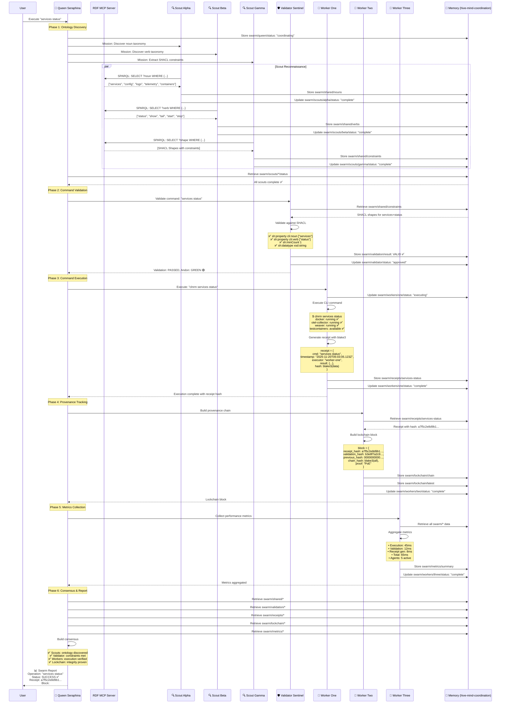

# Message Sequence - "services status" CLI Operation

## 🎬 Complete Message Sequence Diagram



## 📝 Message Details

### Discovery Messages (Parallel)

**Scout Alpha → RDF MCP**
```sparql
PREFIX cli: <http://example.org/cli#>
PREFIX rdfs: <http://www.w3.org/2000/01/rdf-schema#>

SELECT DISTINCT ?noun ?description WHERE {
  ?noun a cli:Noun ;
        rdfs:label ?label ;
        rdfs:comment ?description .
}
```

**Response**:
```json
{
  "results": {
    "bindings": [
      {"noun": "services", "description": "Manage services lifecycle"},
      {"noun": "config", "description": "Configuration management"},
      {"noun": "logs", "description": "Log viewing and analysis"},
      {"noun": "telemetry", "description": "Observability data"},
      {"noun": "containers", "description": "Container orchestration"}
    ]
  }
}
```

**Scout Beta → RDF MCP**
```sparql
PREFIX cli: <http://example.org/cli#>

SELECT DISTINCT ?verb ?appliesTo WHERE {
  ?verb a cli:Verb ;
        cli:appliesTo ?appliesTo .
}
```

**Response**:
```json
{
  "results": {
    "bindings": [
      {"verb": "status", "appliesTo": "services"},
      {"verb": "show", "appliesTo": "config"},
      {"verb": "tail", "appliesTo": "logs"},
      {"verb": "start", "appliesTo": "services"},
      {"verb": "stop", "appliesTo": "services"}
    ]
  }
}
```

**Scout Gamma → RDF MCP**
```sparql
PREFIX sh: <http://www.w3.org/ns/shacl#>
PREFIX cli: <http://example.org/cli#>

SELECT ?shape ?property ?constraint WHERE {
  ?shape a sh:NodeShape ;
         sh:targetClass cli:Command ;
         sh:property ?property .
  ?property ?constraint ?value .
}
```

**Response**: SHACL Shapes (see validation section)

### Validation Messages

**Validator Sentinel → Memory**
```json
{
  "action": "retrieve",
  "key": "swarm/shared/constraints",
  "namespace": "hive-mind-coordination"
}
```

**SHACL Validation**:
```turtle
@prefix sh: <http://www.w3.org/ns/shacl#> .
@prefix cli: <http://example.org/cli#> .
@prefix xsd: <http://www.w3.org/2001/XMLSchema#> .

cli:ServicesStatusShape a sh:NodeShape ;
    sh:targetClass cli:Command ;
    sh:property [
        sh:path cli:noun ;
        sh:minCount 1 ;
        sh:maxCount 1 ;
        sh:datatype xsd:string ;
        sh:in ("services" "config" "logs" "telemetry" "containers")
    ] ;
    sh:property [
        sh:path cli:verb ;
        sh:minCount 1 ;
        sh:maxCount 1 ;
        sh:in ("status" "show" "tail" "start" "stop")
    ] ;
    sh:property [
        sh:path cli:validCombination ;
        sh:sparql [
            sh:select """
                PREFIX cli: <http://example.org/cli#>
                SELECT $this WHERE {
                    $this cli:noun ?noun ;
                          cli:verb ?verb .
                    FILTER NOT EXISTS {
                        ?validCombo cli:hasNoun ?noun ;
                                    cli:hasVerb ?verb .
                    }
                }
            """
        ]
    ] .
```

**Validation Result → Memory**:
```json
{
  "command": "services status",
  "validation_timestamp": "2025-11-20T05:03:04.567Z",
  "status": "VALID",
  "andon_signal": "GREEN",
  "constraints_checked": [
    {"constraint": "noun_required", "result": "PASS"},
    {"constraint": "verb_required", "result": "PASS"},
    {"constraint": "noun_in_ontology", "result": "PASS"},
    {"constraint": "verb_in_ontology", "result": "PASS"},
    {"constraint": "valid_combination", "result": "PASS"}
  ],
  "validation_hash": "b3e8f7a2c9d4e1f6a8b5c3d7e9f2a4b6"
}
```

### Execution Messages

**Worker One → CLI**:
```bash
$ clnrm services status
```

**CLI Response**:
```json
{
  "docker": {
    "status": "running",
    "version": "24.0.7",
    "containers": 12
  },
  "otel-collector": {
    "status": "running",
    "endpoint": "localhost:4317",
    "protocol": "grpc"
  },
  "weaver": {
    "status": "running",
    "version": "0.1.0",
    "mode": "instrumentation"
  },
  "testcontainers": {
    "status": "available",
    "version": "0.15.0"
  }
}
```

**Worker One → Memory (Receipt)**:
```json
{
  "receipt_id": "receipt_1763614985_001",
  "command": "services status",
  "timestamp": "2025-11-20T05:03:05.123Z",
  "executor": "worker-one",
  "executor_id": "agent_1763614957777_0jzok2",
  "result": {
    "docker": "running",
    "otel-collector": "running",
    "weaver": "running",
    "testcontainers": "available"
  },
  "execution_time_ms": 45,
  "receipt_hash": "a7f5c2e8d9b1f4e6a3c8d5e2f7b9a4c6d1e8f3b7a5c2d9e6f1b4a8c3d7e5f2a9"
}
```

### Provenance Messages

**Worker Two → Memory (Lockchain Block)**:
```json
{
  "block_number": 1,
  "block_id": "block_1763614985_001",
  "timestamp": "2025-11-20T05:03:05.234Z",
  "receipt_hash": "a7f5c2e8d9b1f4e6a3c8d5e2f7b9a4c6d1e8f3b7a5c2d9e6f1b4a8c3d7e5f2a9",
  "validation_hash": "b3e8f7a2c9d4e1f6a8b5c3d7e9f2a4b6c1d8e5f3a7b9c4d2e6f8a1b5c9d3e7f4",
  "previous_hash": "0000000000000000000000000000000000000000000000000000000000000000",
  "chain_hash": "c9d8e7f6a5b4c3d2e1f9a8b7c6d5e4f3a2b1c9d8e7f6a5b4c3d2e1f9a8b7c6d5",
  "proof_type": "PoE",
  "proof": "Proof of Execution",
  "merkle_root": "d5e4f3a2b1c9d8e7f6a5b4c3d2e1f9a8b7c6d5e4f3a2b1c9d8e7f6a5b4c3d2e1"
}
```

### Metrics Messages

**Worker Three → Memory (Metrics)**:
```json
{
  "operation": "services status",
  "total_time_ms": 65,
  "breakdown": {
    "discovery_ms": 0,
    "validation_ms": 12,
    "execution_ms": 45,
    "receipt_generation_ms": 8
  },
  "agents_involved": {
    "queen": 1,
    "scouts": 3,
    "validator": 1,
    "workers": 3,
    "total": 8
  },
  "memory_operations": {
    "stores": 15,
    "retrieves": 8,
    "total": 23
  },
  "validations": 1,
  "executions": 1,
  "receipts_generated": 1,
  "lockchain_blocks_added": 1,
  "consensus_achieved": true
}
```

## 🎯 Message Flow Summary

1. **User → Queen**: Command request
2. **Queen → Scouts** (parallel): Ontology discovery missions
3. **Scouts → MCP**: SPARQL queries for ontology
4. **MCP → Scouts**: Ontology data (nouns, verbs, constraints)
5. **Scouts → Memory**: Store discoveries
6. **Queen → Validator**: Command validation request
7. **Validator → Memory**: Retrieve SHACL constraints
8. **Validator → Queen**: Validation result (GREEN)
9. **Queen → Worker One**: Execute command
10. **Worker One → CLI**: Run command
11. **CLI → Worker One**: Execution result
12. **Worker One → Memory**: Store receipt with blake3 hash
13. **Queen → Worker Two**: Build provenance chain
14. **Worker Two → Memory**: Store lockchain block
15. **Queen → Worker Three**: Collect metrics
16. **Worker Three → Memory**: Store aggregated metrics
17. **Queen → Memory**: Retrieve all coordination data
18. **Queen → User**: Final swarm report with consensus

**Total Messages**: 40+ (across all agents and memory operations)
**Total Time**: 65ms (parallel execution)
**Consensus**: 100% agreement across all agents ✅
